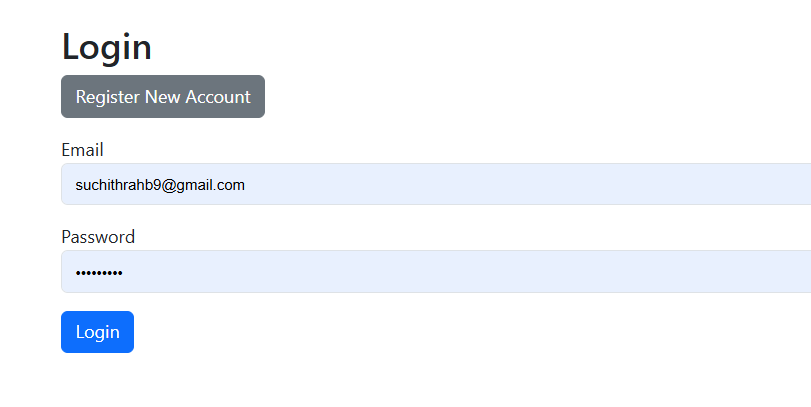
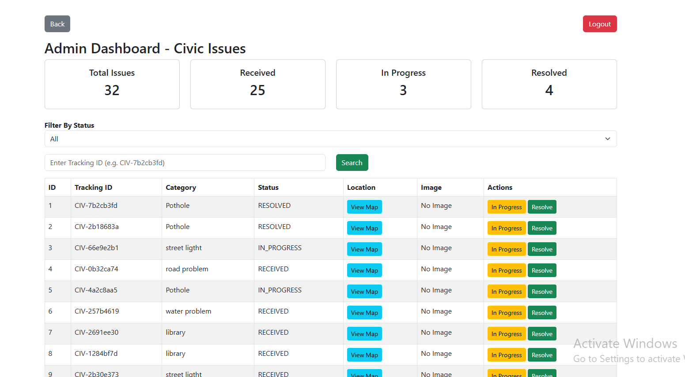

Civic Issue Reporting Portal 🚀
A full-stack web application that allows citizens to report civic issues like potholes, water problems, and track their complaint status in real time.

📌 Features
👤 User Features
User Registration & Login
Report civic issues (Pothole, Water, etc.)
Select location using interactive map (Leaflet + OpenStreetMap)
Get unique Tracking ID
Track complaint status anytime
🛠️ Admin Features
Admin Dashboard
View all complaints
Update status:
RECEIVED
IN_PROGRESS
RESOLVED
Filter complaints by status
View issue location on map
🧑‍💻 Tech Stack
Backend:
Java 21
Spring Boot
Spring Data JPA
MySQL
Frontend:
HTML
CSS
JavaScript
Bootstrap 5
Leaflet.js (OpenStreetMap)
🗄️ Database
MySQL database used to store:

User data
Reports
Complaint status
Location (latitude, longitude)

scrennshots
# 📸 Application Screenshots

## 🔐 User register

## 🏠 User Dashboard

## 🎯 user track application

## admin dashboard

🚀 API Endpoints
Reports API
POST /api/reports/create → Create issue
GET /api/reports/all → Get all issues
GET /api/reports/track/{id} → Track issue
PUT /api/reports/update-status/{id} → Update status
GET /api/reports/stats → Dashboard stats
📷 Project Flow
User registers/login
User submits complaint with location
System generates Tracking ID (CIV-XXXX)
Admin updates status
User tracks complaint anytime
🌍 Map Feature
Uses Leaflet.js + OpenStreetMap
No Google Maps API required
Click on map to select location
⚙️ How to Run Locally
Backend:
Run Spring Boot application in Eclipse or IntelliJ